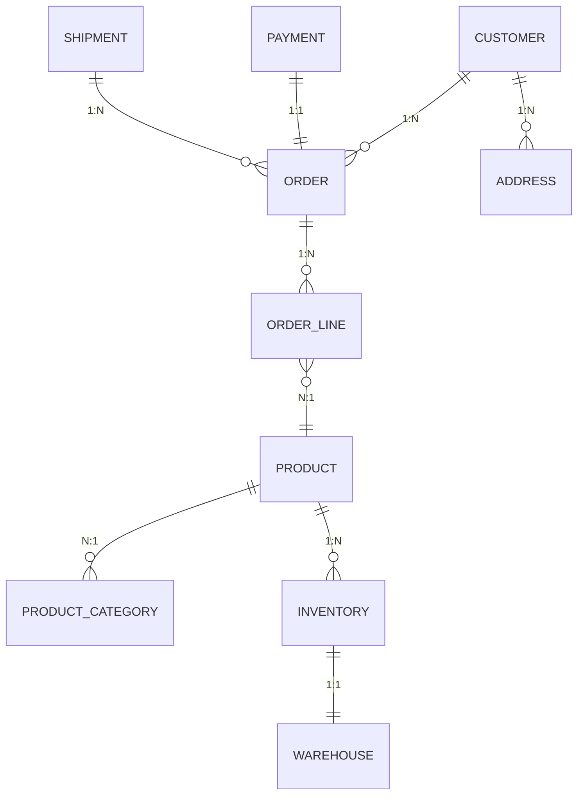

+++
title = "Generate a Dataverse ERD for Azure Dev Ops Wiki"
date = 2025-11-16
draft = false
image = "/images/posts/dataverse-erd.png"
tags = ["Dataverse", "Azure DevOps", "ERD", "Documentation", "Mermaid JS", "Power Platform"]
+++

Nobody likes manually writing and updating Documentation. ERDs (Entity Relationship Diagrams) provide a really helpful overview of what your database relationships look like.

Context: We are using Azure DevOps (ADO) to manage our CI/CD Pipelines using the [Power Platform Tools](https://learn.microsoft.com/en-us/power-platform/alm/devops-build-tools) and therefore the Solutions are unpacked and stored in the Repository (there may be multiple Solutions inside of a Project).

The idea: working with Power Platform solutions stored in ADO, it would be great to visualise complex entity relationships right inside ADO. Visualizing these relationships can make solution design and troubleshooting much easier, it certainly helps me.

In this quick post, we'll use a short prompt using [Chat in VS Code](https://code.visualstudio.com/docs/copilot/chat/getting-started-chat) to get an AI Agent to generate a **Mermaid ERD** from our Dataverse solution files and then we can copy it and publish it to our ADO Wiki. 

---

## ✅ Why This Matters

- **Better Documentation**: ERDs help us understand entity relationships at a glance.
- **Native Rendering**: Mermaid diagrams render natively in ADO Wiki.
- **Automation Ready**: This process could be adapted for CI/CD pipelines later. For this we can implement [Ian Tweedie - Upload Markdown to Wiki
](https://mightora.io/tools/cicd/upload-md-to-wiki/)

---

## **Step 1: Clone the Repository in VS Code**

1. In **Azure DevOps**, go to **Repos → Clone → IDE**.

---
2. Select **Clone in VS Code**.

---
3. Choose a local folder where the repo will be stored.


## **Step 2: Locate a Relationships File**

1. In VS Code, navigate to the Power Platform solution folder inside the repo.
2. Go to: **Other → Relationships.xml**

---
(if there is more than one Relationships.xml file, you may need to repeat these steps)
3. Open **`Relationships.xml`** in VS Code.


## **Step 3: Use AI to Generate the ERD**

1. Open **Chat** in VS Code with `Relationships.xml` in file context.
2. Paste this prompt:

```
Please scan this file and identify all Dataverse-related entities and their relationships. Focus on extracting entity names, attributes, and how they relate to each other (e.g. one-to-many, many-to-one, many-to-many). Then, generate a Mermaid entity-relationship diagram (ERD) that includes cardinality for each relationship.

 Format the output as a Markdown file containing the Mermaid ERD code block. Ensure the diagram is readable and reflects the structure of the Dataverse schema as accurately as possible.

If any assumptions are made due to missing or ambiguous information, please list them at the end of the Markdown file.
```


## **Step 4: Copy the Mermaid Diagram**

From the AI response, copy everything starting from:

**erDiagram**



Example Mermaid

---

## **Step 5: Publish to ADO Wiki**

1. In **Azure DevOps**, go to **Overview → Wiki**.
2. Click **New Page**.
3. Paste the Markdown (including the Mermaid block) into the **left-hand pane**.
4. Give the page a title.
5. Click **Save**.


---

### ✅ Pro Tip

Mermaid diagrams render natively in ADO Wiki, so your ERD will be interactive and easy to read 😜.

---

## **Possible Next Steps**

- Automate this process using a pipeline - this is going to require me to learn some fancy PowerShell Scripts to parse the XML 😵‍💫.
- This could allow Automatic Documentation as part of a Release, keeping the ERD up to date.
- Add entity attributes for deeper insights.


